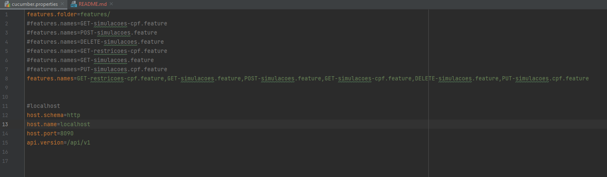

## **prova-tecnica-api-test**

Projeto criado para execução de testes automatizados de API contendo steps e features

 

### **Pré-requisitos**

    - Java 11
    - Maven
    - IDE da sua preferência (no meu caso estou usando o intelliJ IDEA)

 

### **Estrutura do projeto**

    Caminho src\main\java\stepDefinitions\restAPI: você encontra todas os steps criados para esse teste
    Caminho src\main\resources\features: você encontra todas as features criadas para esse teste
    Caminho src\main\resources: você encontra o cucumber.properties
    No terminal ou no maven que fica à direita execute o comando "mvn clean install"

 

### **Arquivo cucumber.properties:**

 

### Rodando os testes

    Rodando apenas uma feature:
        features.folder=features/
        features.names=POST-simulacoes.feature
    Rodando todas as features:
        features.folder=features/
        features.names=POST-simulacoes.feature,outra.feature

    Em cucumber.properties você pode definir o baseURI do projeto;
    Na hora de rodar os testes e preferir rodar os testes com outra porta (porta cadastrada 8090) é necessário alterar essa informação no cucumber.properties.

 

### Features

    No step Given I have baseURI "localhost": caso você crie outra configuração, precisa alterar em todos as features essa informação;
    Mas não se preocupe, é só executar o comando CTRL + SHIFT + R e escolher a opção "Replace All";
    Pronto, seus testes estão prontos para execução!

 

 

### RestRunner

    Criar configuração da aplicação setando o caminho:
        restRunner.RestRunner

 

 

### Execução dos testes:
    - Para o teste enviado deixei definido no cucumber.properties todas as features para rodar;
    - Execute o RestRunner;
    - Pronto, no terminal você vai encontrar todos os cenários que foram executados;
    - No terminal você consegue ver também um link para abrir o cucumber-html-reports; 
    - Você pode copiar o link e colar no navegador de sua escolha e olhar mais detalhes do que foi executado. 

 

 

### Features no cucumber-html-reports

 

### Detalhe da feature

    
